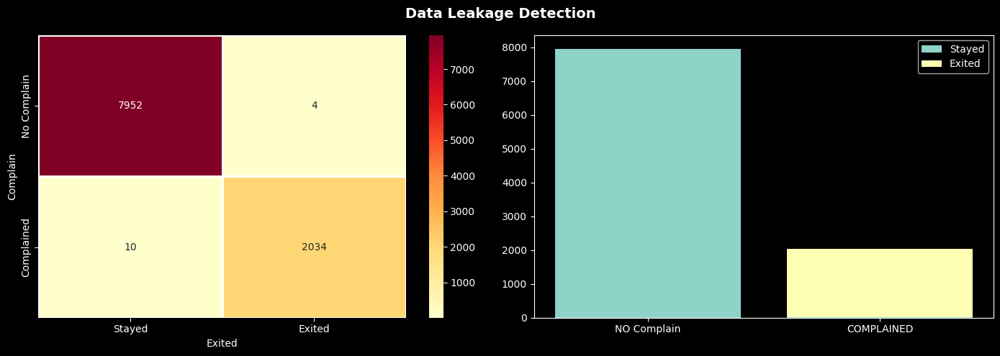
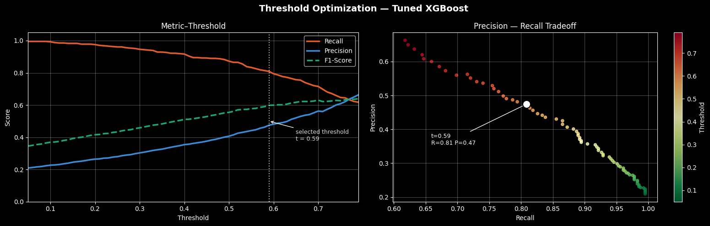
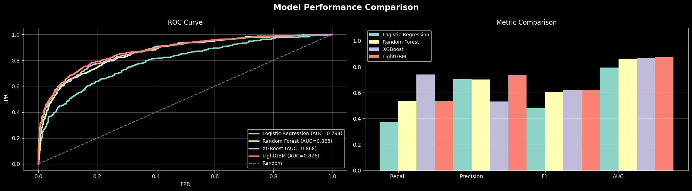
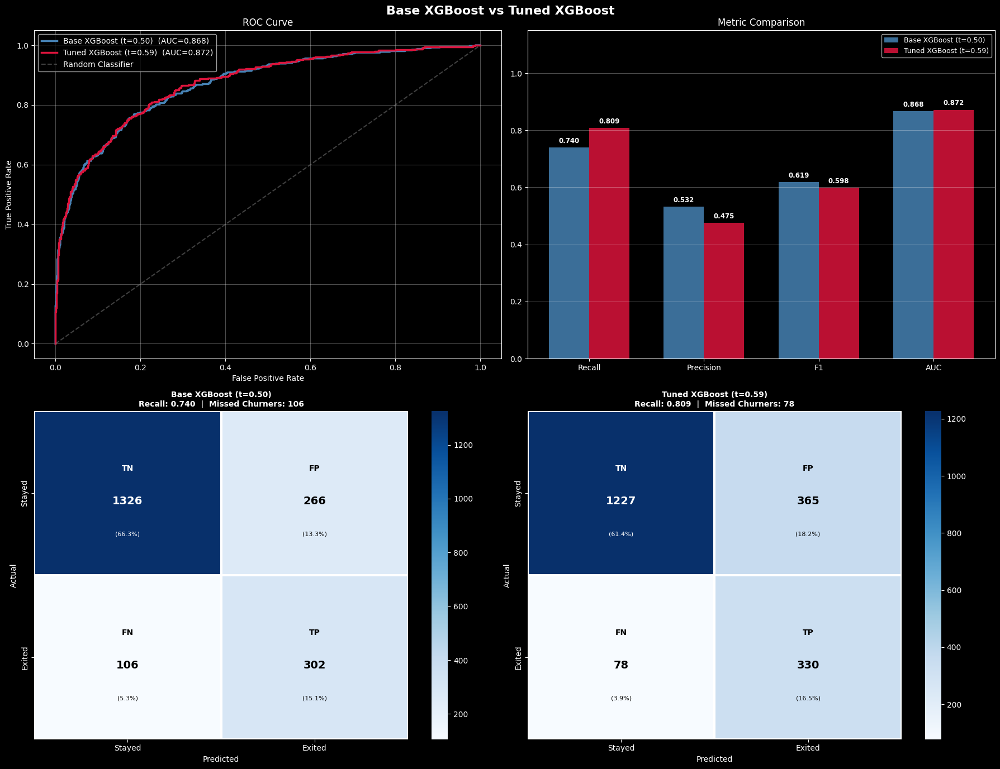
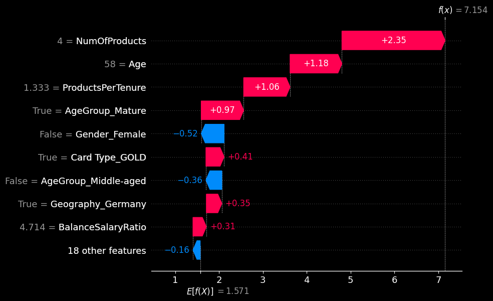
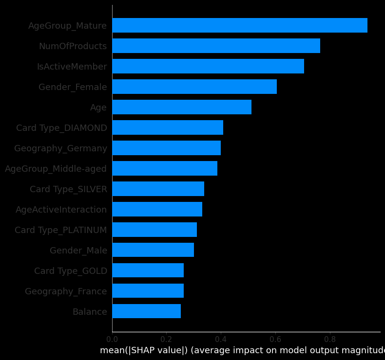

# Bank Customer Churn

> End-to-end machine learning pipeline to predict bank customer churn   
> featuring data leakage detection, SMOTE-in-pipeline, Optuna hyperparameter optimization, SHAP explainability, and business impact simulation.
---

##  Problem Statement

Customer churn is one of the most costly problems in retail banking. Acquiring a new customer costs 5–7× more than retaining an existing one. This project builds a model that:

- **Identifies** customers at high risk of leaving the bank
- **Prioritizes recall** — missing a churner is more costly than a false alarm
- **Constrains precision** to avoid over-targeting low-risk customers with expensive campaigns
- **Quantifies business value** in terms of retained revenue vs. campaign cost

---

##  Dataset

**Source:** [Bank Customer Churn Records Kaggle](https://www.kaggle.com/datasets/radheshyamkollipara/bank-customer-churn)

| Property | Value |
|---|---|
| Rows | 10,000 |
| Features | 18 (original) → 22 (engineered) |
| Target | `Exited` (1 = churned, 0 = stayed) |
| Class balance | ~20% churn (imbalanced) |

**Key features:** CreditScore, Geography, Gender, Age, Tenure, Balance, NumOfProducts, HasCrCard, IsActiveMember, EstimatedSalary, Satisfaction Score, Card Type, Point Earned

---

##  Key Decisions

### Data Leakage Detection & Removal

 During EDA, `Complain` showed a **0.99 correlation** with `Exited`.
Cross-tabulation revealed that ~99% of churned customers had filed a complaint — meaning the complaint is a *consequence* of the decision to leave, not a predictor available at inference time.

**Decision:** `Complain` was dropped from all features.

> Including it would yield ~99.9% accuracy — but the model would be useless in production since complaints are only recorded *after* the customer decides to leave.



###  SMOTE Applied Inside Cross-Validation Folds

A common mistake is applying SMOTE to the entire training set before cross-validation, which causes synthetic samples to leak between folds and inflates CV scores.

This project uses `imblearn.pipeline.Pipeline` to ensure SMOTE is applied **only to the training fold** at each CV iteration giving honest evaluation metrics.

### Precision-Constrained Recall Optimization

The Optuna objective maximizes **recall subject to precision ≥ 0.40**.

Rationale: In churn prevention, false negatives (missed churners) are costly, but spamming every customer with retention offers is also expensive and damages trust. A minimum precision floor ensures the model is commercially viable.

### Threshold Optimization

Default 0.5 threshold is rarely optimal for imbalanced classification. After training, the optimal threshold is selected by scanning the precision-recall-F1 space and finding the point that satisfies the precision constraint while maximizing recall.


---

##  Methodology

```
Raw Data
│
├─► EDA → Data Leakage Detection (Complain removed)
│
├─► Outlier Analysis (IQR — kept, tree models robust to outliers)
│
├─► Feature Engineering
│     BalanceSalaryRatio, AgeGroup, TenureAgeRatio,
│     IsZeroBalance, ProductsPerTenure
│
├─► Train/Test Split (80/20, stratified)
│
├─► SMOTE (inside CV pipeline — no data leakage)
│
├─► Model Training & Comparison
│     Logistic Regression │ Random Forest │ XGBoost │ LightGBM
│
├─► Optuna HPO (XGBoost, 50 trials, precision-constrained recall)
│
├─► Threshold Optimization
│
├─► SHAP Explainability (summary + waterfall + dependence plots)

```

---

##  Results

### Model Comparison

| Model | Recall | Precision | F1 | ROC-AUC |
|---|---|---|---|---|
| Logistic Regression | 0.37 | 0.70 | 0.48 | 0.79 |
| Random Forest | 0.53 | 0.70 | 0.60 | 0.86 |
| XGBoost (base) | 0.74 | 0.53 | 0.61 | 0.86 |
| LightGBM | 0.53 | 0.73 | 0.62 | 0.87 |
| **XGBoost (Optuna-tuned)** | **0.87** | **0.41** | **0.55** | **0.77** |
| **XGBoost (Threshold Optimization)** | **0.81** | **0.47** | **0.59** | **0.79** |
 



    
### Top Predictive Features (SHAP)

* **AgeGroup_Mature** : the single strongest predictor; mature-age customers are disproportionately likely to churn, outweighing raw Age as a standalone feature
* **NumOfProducts** : high impact in both directions; having 3–4 products is an extreme churn signal (waterfall example: NumOfProducts=4 contributes +2.35 to model output alone)
* **IsActiveMember** : passive members are far more likely to leave; one of the most actionable features for retention targeting
* **Gender_Female** : female customers churn at a notably higher rate, especially in Germany; ranks above Balance in global importance
* **Age (raw)** : reinforces AgeGroup_Mature; older age consistently pushes predictions toward churn
* **Card Type_DIAMOND & Geography_Germany** : similar importance level; German customers and diamond cardholders show elevated churn risk independent of other features



---

## Installation

 ```bash
git clone https://github.com/berkw2b/bank-churn-analysis.git
cd bank-churn-prediction
pip install -r requirements.txt
```

Download the dataset from [Kaggle](https://www.kaggle.com/datasets/radheshyamkollipara/bank-customer-churn) and place `Customer-Churn-Records.csv` in the project root.

---


## Tech Stack

`Python 3.10+` · `scikit-learn` · `XGBoost` · `LightGBM` · `imbalanced-learn` · `Optuna` · `SHAP` · `pandas` · `matplotlib` · `seaborn`
